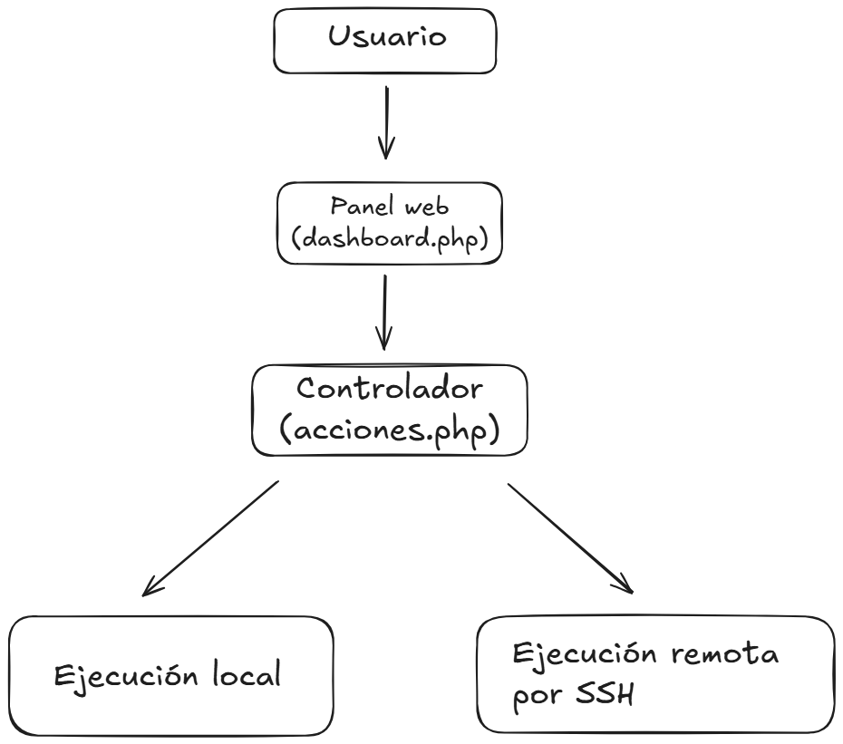
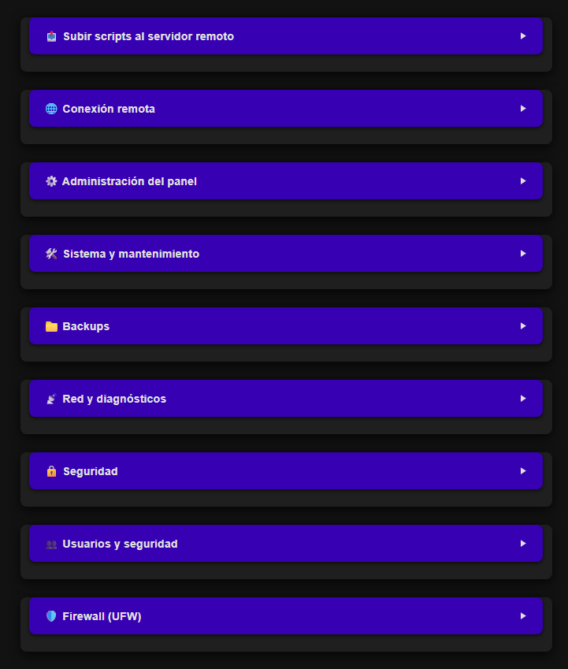
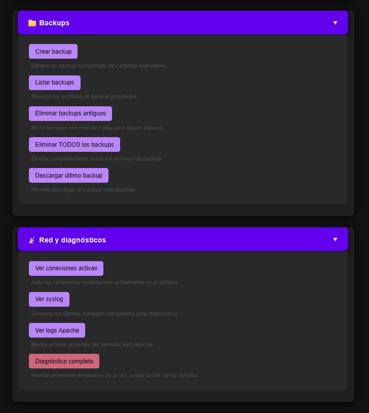
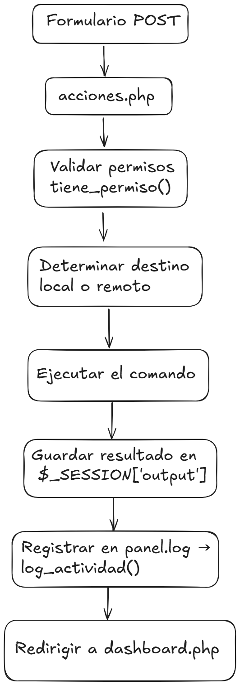
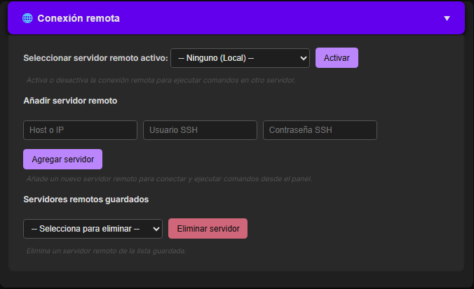
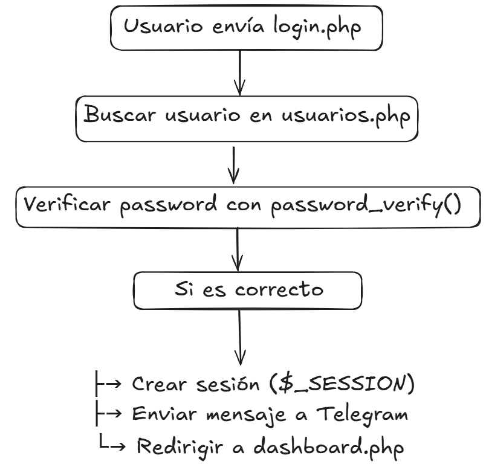
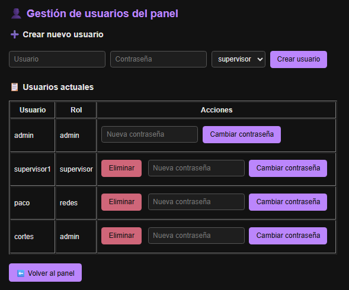
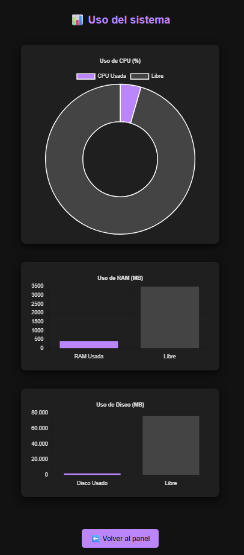
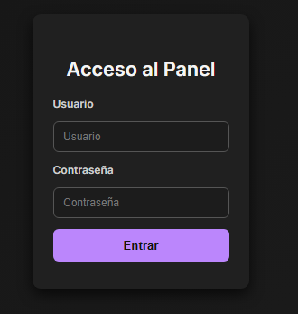

# Documentación del Proyecto: Panel de Administración con Gestión de Conexión Remota

## Índice

- **Introducción General**
    
    - Objetivo del proyecto
        
    - Características principales
	      
    - Medios Utilizados
        
    - Público objetivo
    
- **Arquitectura del Sistema**
    
    - Visión general en tres capas
        
    - Descripción del controlador central (`acciones.php`)
        
    - Ejecución local vs remota
    
- **Estructura del Proyecto**
    
    - Archivos principales y su función
        
    - Organización por carpetas (`inc/`, `templates/`, `logs/`, etc.)
        
    - Variables de sesión utilizadas
    
- **Interfaz de Usuario**
    
    - Diseño SPA con secciones tipo acordeón
        
    - Cabecera de estado e interacción
        
    - Formularios y retroalimentación visual
    
- **Categorías Funcionales del Panel**
    
    - Mantenimiento del sistema
        
    - Backups
        
    - Gestión de usuarios
        
    - Seguridad y firewall (UFW)
        
    - Conexiones remotas SSH
        
    - Diagnóstico de red
        
    - Scripts remotos
        
    - Monitorización gráfica
    
- **Gestión de Usuarios y Roles**
    
    - Autenticación con bcrypt y sesiones
        
    - Control de acceso basado en roles (RBAC)
        
    - Creación, modificación y eliminación de usuarios
        
    - Seguridad en la gestión de roles (`roles.php`)
    
- **Ejecución de Comandos**
    
    - Flujo de ejecución: local y remoto
        
    - Funciones clave: `ejecutar()`, `ejecutar_local()`, `ejecutar_remoto()`
        
    - Seguridad en ejecución y validación de acciones
    
- **Sistemas de Logs y auditorias**

    - Registro de actividad (`log_actividad`)
        
    - Formato y almacenamiento de logs
        
    - Acceso a los registros desde el panel
    
- **Monitorización en Tiempo Real**
    
    - Arquitectura de monitorización
        
    - Gráficos interactivos con Chart.js
        
    - Métricas recolectadas (CPU, RAM, disco)
        
- **Integración con Telegram**
    
    - Notificaciones de login
        
    - Configuración del bot (`inc/config.php`)
        
    - Flujo de notificación automática
    
- **Estilo Visual y Accesibilidad**
    
    - Tema oscuro y diseño responsive
        
    - Accesibilidad (atributos ARIA, navegación por teclado)
        
    - Interfaz adaptada a diferentes perfiles
    
- **Seguridad General del Sistema**
    
    - Validaciones, escapes y protección XSS
        
    - Bloqueo de archivos, control de caché y restricciones por sesión
        
    - Gestión segura de credenciales y comandos

## 1. 🧭 Introducción General

El **Panel de Administración de Servidores Linux** es una aplicación web desarrollada en PHP, diseñada para simplificar la gestión de servidores tanto locales como remotos desde una única interfaz centralizada. Este sistema permite a los administradores ejecutar acciones comunes de mantenimiento, seguridad, supervisión y configuración sin necesidad de acceder manualmente por terminal a cada máquina.

### 🎯 Objetivo del Proyecto

El propósito principal del panel es ofrecer una **herramienta visual, segura y extensible** que permita:

- **Administrar múltiples servidores** desde un único punto.
    
- Ejecutar comandos local o remotamente mediante SSH.
    
- Controlar el acceso a funciones según el **rol del usuario**.
    
- Visualizar en tiempo real el estado del sistema (CPU, RAM, disco).
    
- Facilitar tareas críticas como backups, configuración de firewall, diagnóstico de red, gestión de usuarios y más.


### ✨ Características Principales

- Aplicación tipo **SPA** (Single Page Application) con diseño en **acordeones plegables** por categoría.
    
- **Ejecución unificada** de acciones locales o remotas según la sesión activa.
    
- **Control de acceso basado en roles (RBAC)** configurable dinámicamente.
    
- **Autenticación segura** con contraseñas cifradas en bcrypt.
    
- **Registro de actividad** con auditoría detallada en cada acción.
    
- **Alertas automáticas por Telegram** ante eventos clave como inicios de sesión.

### 🛠️ Medios Utilizados

Para el desarrollo y despliegue de este proyecto se han utilizado los siguientes recursos y herramientas:

- 🌐 **Servidor principal (droplet)**: Alojado en **DigitalOcean**, donde se encuentra instalado el panel y se gestionan tanto los servicios como los archivos de configuración y ejecución.
- 🖥️ **Servidores gestionados**: También desplegados en DigitalOcean y configurados para conexión vía SSH desde el panel.
- 📦 **Software base**:
	- Sistema operativo: Debian/Ubuntu
	- Servidor web: Apache2
	- PHP 8.x con módulos comunes
	- `sshpass`, `ufw`, `fail2ban`, `cron`, `scp`, `top`, `df`, `free`, etc.
- 📬 **Telegram Bot** para notificaciones de eventos críticos (logins).
- 💾 **Almacenamiento remoto** para backups y scripts mediante `scp`.
- 🖼️ **Frontend responsivo** con HTML, CSS y JavaScript puro (sin frameworks).
- 📈 **Chart.js** para monitorización visual de recursos en tiempo real.

### 👥 Público Objetivo

Este panel está pensado especialmente para:

- Administradores de sistemas que gestionan múltiples servidores Linux.
    
- Entornos educativos donde se enseña administración remota.
    
- Proyectos de automatización, monitorización y mantenimiento de sistemas.
    
- Usuarios que deseen una solución centralizada sin depender del terminal.


## Arquitectura Central

### ✅ Visión General

El **Panel de Administración de Servidores Linux** es una app web PHP organizada en tres capas:

1. **Interfaz de Usuario**
2. **Aplicación Central (acciones.php)**
3. **Capa de Ejecución (local o remota)**

Se utiliza un controlador central (`acciones.php`) para manejar todas las acciones, con funciones unificadas como `ejecutar()` para decidir si ejecutar comandos localmente o por SSH.



### ⚙️ Componentes Clave

- **acciones.php**: controlador principal que gestiona:
	- Servidores remotos
	- Ejecución de comandos (`ejecutar_local`, `ejecutar_remoto`)
	- Permisos (`tiene_permiso`)
	- Registro de actividad (`log_actividad`)
	- Acciones del sistema (switch-case)
- **Sesiones PHP**:
	- `$_SESSION['usuario']`, `$_SESSION['rol']`, `$_SESSION['remoto']`, `$_SESSION['output']`

---

### 🌐 Conexiones Remotas

- Configuradas en `remotos.json`
- Activas mediante `$_SESSION['remoto']`
- Formato:
```
{
  "server_host": {
    "usuario": "ssh_username",
    "clave": "ssh_password"
  }
}
```
---


### 📁 Organización de Archivos

- `dashboard.php`: interfaz principal
- `login.php`: login y sesiones
- `inc/`:
	- `auth.php`: control de sesión
	- `roles.php`: permisos por rol
	- `usuarios.php`: usuarios y contraseñas
	- `config.php`: token de Telegram, etc.
- `templates/`: cabecera y pie de página
- `logs/panel.log`: registro de actividad

---

### 🔄 Gestión de Estado

- Sistema con estado mediante variables de sesión
- La ejecución depende de si `$_SESSION['remoto']` está activo → local o remoto

---
## 🖥️ Interfaz del Panel

### 🧩 Estructura General

La interfaz es una aplicación de una sola página (SPA) con secciones en **acordeón colapsable** que agrupan las funciones por categorías. Su contenido se **renderiza dinámicamente según el rol del usuario** y si hay conexión remota activa.



---

### 🧱 Componentes Principales

- **Encabezado**: muestra nombre de usuario, rol, servidor remoto (o local) y botón de logout (`dashboard.php`, líneas 25–31).
- **Resultado de comandos**: se usa `$_SESSION['output']` para mostrar salida de acciones ejecutadas y luego se elimina.
- **Interfaz de acordeón**: controlado con JavaScript puro; cada sección tiene encabezado + contenido con formularios.

---

### 📂 Secciones del Acordeón

| Sección | ID | Líneas | Función Principal |
| --- | --- | --- | --- |
| Scripts | `scripts` | 41–51 | Subida de scripts a servidores remotos |
| Conexión Remota | `conexion-remota` | 53–98 | Gestión de conexiones SSH |
| Panel Admin | `admin-panel` | 100–123 | Gestión de roles y usuarios |
| Mantenimiento | `sistema` | 125–184 | Operaciones básicas del sistema |
| Backups | `backups` | 187–216 | Crear y administrar backups |
| Diagnóstico de Red | `red` | 218–243 | Ver conexiones activas, ping, etc. |
| Seguridad | `seguridad` | 245–266 | Revisar intentos fallidos, sesiones |
| Gestión de Usuarios | `usuarios` | 268–310 | Alta, baja y modificación de usuarios |
| Firewall | `firewall` | 312–359 | Estado y reglas de UFW |



---

### 🔐 Renderizado según Permisos

Se usa `tiene_permiso()` para mostrar/ocultar botones o formularios según el rol:

```
<?php if (tiene_permiso('crear_usuario')): ?>
```

Esto permite una interfaz dinámica y segura basada en permisos.

---

### 🌍 Integración con Servidores Remotos

- Las credenciales se cargan desde `remotos.json`.
- Desde el acordeón se pueden seleccionar, añadir o eliminar conexiones.
- La conexión activa se guarda en `$_SESSION['remoto']`.

---

### 🔁 Flujo de Acciones y Formularios

Los formularios del panel se dirigen a `acciones.php` mediante `POST` (principalmente), usando parámetros como `name="accion" value="nombre_accion"`.



#### Tipos de Formularios

| Tipo | Método | Archivo destino | Parámetros clave |
| --- | --- | --- | --- |
| Acciones simples | POST | `acciones.php` | `accion = nombre_accion` |
| Conexión remota | POST | `acciones.php` | host, usuario, contraseña |
| Gestión de usuarios | POST | `acciones.php` | nombre, rol, contraseña |
| Páginas externas | GET | `gestionar_usuarios.php`, etc. | sin `accion` |

---

### 📂 Categorías de Acciones

| Categoría       | Ejemplos de Acciones                            | Líneas Aprox. |
| --------------- | ----------------------------------------------- | ------------- |
| Sistema         | `uso_sistema`, `actualizar_sistema`             | 131–168       |
| Backups         | `hacer_backup`, `listar_backups`                | 193–214       |
| Seguridad       | `intentos_fallidos`, `usuarios_conectados`      | 251–264       |
| Usuarios        | `crear_usuario`, `eliminar_usuario`             | 274–308       |
| Firewall        | `ufw_estado`, `agregar_regla`, `eliminar_regla` | 318–357       |
| Conexión Remota | `servidor_remoto_seleccionado`, etc.            | 59–95         |

---
## ⚙️ Controlador de Acciones

### 🧠 Rol Principal

El archivo `acciones.php` actúa como **centro de procesamiento** del panel, recibiendo solicitudes del usuario, **verificando permisos**, ejecutando comandos local/remoto y devolviendo los resultados. Gestiona tareas como backups, usuarios, seguridad, red y logs.

---

### 🧱 Arquitectura Interna

- Patrón **solicitud-respuesta** basado en `POST + switch-case`.
- Usa sesiones para determinar si ejecutar comandos **locales o remotos** (`$_SESSION['remoto']`).

---

### 🚀 Sistema de Ejecución de Comandos

| Función | Propósito |
| --- | --- |
| `ejecutar()` | Enrutador principal con códigos de retorno |
| `ejecutar_local()` | Ejecuta en el servidor local |
| `ejecutar_remoto()` | Ejecuta vía SSH con `sshpass` |
| `ejecutar_simple()` | Compatibilidad heredada |

**Comando SSH usado:**

```
sshpass -p $clave ssh -o StrictHostKeyChecking=no -o ConnectTimeout=5 $usuario@$host $comando
```

---

### 🌐 Gestión de Servidores Remotos

- Configuración almacenada en `remotos.json`.
- Conexiones activas se guardan en `$_SESSION['remoto']`.
```
$servidores = [
  'hostname' => [
    'usuario' => 'username',
    'clave' => 'password'
  ]
];
```

---

### 🔄 Canal de Procesamiento de Acciones

- Validación de permisos con `tiene_permiso()`
- Ejecución de acción (`switch`)
- Almacenamiento del resultado en `$_SESSION['output']`
- Registro con `log_actividad()`

---

### 🔐 Seguridad y Validación

- Verificación de sesión y rol antes de cada acción.
- Funciones de validación:

| Función | Uso |
| --- | --- |
| `validar_post()` | Verifica parámetros POST |
| `usuario_existe()` | Confirma existencia de usuario |

**Ejemplo de validación de permisos:**

```
if (!tiene_permiso($accion)) {
    $_SESSION['output'] = "❌ No tienes permiso para esta acción.";
    header("Location: dashboard.php");
    exit;
}
```

---

### 📝 Registro de Actividad

- Cada acción se registra con:
	- Fecha y hora
	- Usuario
	- Nombre de acción
```
log_actividad($usuario, $accion);
```

Guardado en `logs/panel.log`, con creación automática del directorio si no existe.

---

### 🧩 Categorías de Acciones

| Categoría | Nº Acciones | Ejemplos |
| --- | --- | --- |
| Backup | 5 | `hacer_backup`, `listar_backups` |
| Sistema | 8 | `uso_sistema`, `ver_procesos` |
| Usuarios | 4 | `crear_usuario`, `cambiar_password` |
| Seguridad | 6 | `ufw_estado`, `intentos_fallidos` |
| Red | 2 | `diagnostico_red`, `ver_conexiones` |
| Logs | 3 | `ver_logs`, `ver_log_panel` |

---

### ⚙️ Patrones de Comando

- Comandos con `sudo`, validación de entrada y salida formateada.
- Resultados claros con emojis y estructuras.
- Captura de errores y retorno de códigos.

---

## 🖧 Gestión de Servidores Remotos

### 🔍 Visión General

El sistema permite a los administradores gestionar **múltiples servidores Linux** (locales o remotos) desde una **interfaz web centralizada**, sin necesidad de modificar el código para cambiar entre ejecución local y remota.



---

### 🧱 Arquitectura General

- Almacena configuraciones de servidores en `remotos.json`
- Utiliza **sesiones PHP** para mantener la conexión activa
- Permite **añadir, seleccionar o eliminar** servidores remotos desde el panel

---

### 🗂️ Registro y Configuración de Servidores

| Campo | Validación |
| --- | --- |
| `nuevo_host` | No vacío |
| `nuevo_usuario` | No vacío |
| `nuevo_clave` | No vacío |

> Las conexiones activas se almacenan en `$_SESSION['remoto']`.

**Lógica de selección:**

- Elegir "local" → desactiva remoto
- Elegir servidor válido → activa remoto
- Datos inválidos → error

**Eliminación:** si el servidor eliminado estaba activo, el sistema revierte a modo local.

---

### ⚙️ Ejecución de Comandos

#### 🔁 Flujo Unificado

La función `ejecutar()` determina si debe ejecutar el comando localmente o remotamente según el estado de la sesión.

#### 🖥️ Ejecución Local

```
function ejecutar_local($comando) {
    $resultado = shell_exec($comando . ' 2>&1');
    return $resultado ?: "No se produjo salida del comando.";
}
```

#### 🌐 Ejecución Remota (vía SSH)

Construcción del comando:

```
sshpass -p PASSWORD ssh -o StrictHostKeyChecking=no -o ConnectTimeout=5 USUARIO@HOST COMANDO
```

> Usa `sshpass` para la autenticación por contraseña y configura un timeout seguro.

---

### 🧩 Interfaz Unificada

La función `ejecutar()` encapsula:

- Enrutamiento local/remoto
- Captura de salida
- Gestión de errores

## 🧾 Sistema de Despliegue de Scripts

### 🎯 Objetivo

Permitir que los scripts administrativos esenciales del panel estén disponibles también en los **servidores remotos**, copiándolos automáticamente desde el servidor local.

### 📂 Scripts desplegados

Los scripts se suben al directorio remoto: `/usr/local/bin/`.

### ⚙️ Proceso de Despliegue

Cada script se despliega mediante:

- **`scp` + `sshpass`** para la copia
- **`chmod +x`** remoto para hacerlo ejecutable
- Registro del resultado (éxito o error)

---

### 🗂️ Estructura de Configuración y Sesión

**Archivo `remotos.json`**:

```
{
  "hostname": {
    "usuario": "ssh_user",
    "clave": "ssh_password"
  }
}
```

**Sesión activa (`$_SESSION['remoto']`)**:

```
[
  'host' => 'hostname',
  'usuario' => 'ssh_user',
  'clave' => 'ssh_password'
]
```

---

### 🔒 Seguridad

- Requiere permisos (`tiene_permiso()`)
- Comandos y datos sanitizados (`escapeshellarg()`)
- Comunicación remota cifrada por SSH
- Conexión aislada por sesión

---

## 🔐 Autenticación y Autorización – Resumen

### 🔄 Flujo de Login

1. Usuario envía credenciales → `login.php`
2. Se validan con `password_verify()` contra hashes bcrypt en `$usuarios_validos`
3. Si es exitoso:
	- Se crean variables de sesión (`$_SESSION`)
	- Se envía alerta por **Telegram**
	- Se redirige al panel (`dashboard.php`)



---

### 👥 Almacenamiento de Usuarios

- Datos en `inc/usuarios.php`
- Estructura:
```
$usuarios_validos = [
  "nombre" => [
    "hash" => "...",     // bcrypt
    "rol" => "admin"
  ]
];
```

---

### 🧠 Gestión de Sesiones

- Se inicializa con `session_start()`
- Protegida por `inc/auth.php`
- Cache deshabilitado con encabezados `Cache-Control`

---

### 🧑‍🏫 Control de Acceso (RBAC)

| Rol | Acceso | Usuarios ejemplo |
| --- | --- | --- |
| `admin` | Completo (`*`) | admin, cortes |
| `supervisor` | Funciones básicas | supervisor1 |
| `redes` | Funciones de red | paco |

> El rol se guarda en `$_SESSION['rol']` y se comprueba con `tiene_permiso()`.

---

### 🛡️ Seguridad Aplicada

- **Bcrypt** con coste 10 para contraseñas
- **Cabeceras** para evitar caché de datos sensibles
- **Telegram** para auditar accesos
- **htmlspecialchars()** para prevenir XSS
- Comparación segura de contraseñas (anti-timing attacks)

## Inicio de Sesión

### 📥 Flujo de Autenticación (`login.php`)

1. Usuario envía formulario de login vía `POST`.
2. Se busca el usuario en `$usuarios_validos`.
3. Se valida la contraseña con `password_verify()`.
4. Si es correcto:
	- Se crea la sesión (`$_SESSION`)
	- Se envía alerta por Telegram
	- Se redirige al panel (`dashboard.php`)

### 📌 Variables de sesión creadas

```
$_SESSION['autenticado'] = true;
$_SESSION['usuario'] = $usuario;
$_SESSION['rol'] = $user_role;
```

---

### 🔎 Protección de Recursos

Todas las páginas privadas incluyen:

```
<?php include_once 'inc/auth.php'; ?>
```

Este archivo valida sesión y evita el acceso no autorizado.

---

### ⚠️ Manejo de errores

- Mensaje genérico: ❌ “Credenciales incorrectas.”
- Sanitización con `htmlspecialchars()` (prevención XSS)
- No se informa si el fallo fue por usuario o contraseña

---

## 🛂 Control de Acceso Basado en Roles (RBAC)

### 🎯 Objetivo

Permitir que solo usuarios con permisos adecuados accedan a ciertas funciones del panel.

### 🧱 Definición de Roles (`inc/roles.php`)

```
$roles = array (
  'supervisor' => ['ufw_estado', 'puertos_abiertos'],
  'redes' => ['ver_uso_grafico', 'ufw_estado', ...],
  'admin' => ['*'] // acceso total
);
```

### 🔍 Verificación de Permisos – `tiene_permiso()`

```
function tiene_permiso($accion) {
    global $roles;
    $rol = $_SESSION['rol'] ?? null;
    if (!$rol || !isset($roles[$rol])) return false;
    return in_array('*', $roles[$rol]) || in_array($accion, $roles[$rol]);
}
```

Evalúa si el rol actual tiene permiso para ejecutar una acción concreta o si tiene acceso total (`*`)


## Arquitectura de Permisos (RBAC)

### 🎯 Acciones Protegidas por Categoría

El sistema controla el acceso a acciones como:

- **Backups:** `hacer_backup`, `listar_backups`, etc.
- **Sistema:** `uso_sistema`, `actualizar_sistema`, etc.
- **Seguridad:** `usuarios_conectados`, `intentos_fallidos`, etc.
- **Firewall y Red:** `ufw_estado`, `ver_conexiones`, etc.
- **Usuarios y Logs:** `crear_usuario`, `ver_logs`, etc.

### 🛡️ Gestión de Roles

- Solo los usuarios con rol `admin` pueden gestionar roles.
- Los cambios regeneran el archivo `roles.php` con el nuevo array de permisos.
- Protección especial para el rol `admin`: no se puede eliminar ni editar sus permisos críticos.
- Se evita borrar roles si hay usuarios aún asignados.

### 🔄 Flujo y Aplicación de Permisos

- El sistema integra `tiene_permiso()` en el controlador (`acciones.php`) para verificar cada acción.
- Los permisos se asignan durante el login y se almacenan en `$_SESSION['rol']`.

---

## 👤 Gestión de Usuarios

### 🗃️ Almacenamiento

Usuarios almacenados en `inc/usuarios.php` como array PHP:

```
$usuarios_validos = [
  'admin' => ['hash' => '...', 'rol' => 'admin'],
  ...
];
```

### 🧰 Funciones Disponibles

- **Crear usuario:** requiere nombre, contraseña y rol.
- **Eliminar usuario:** `admin` no puede ser eliminado.
- **Cambiar contraseña:** requiere usuario y nueva clave, cifrada con `password_hash()`.

### 🔒 Seguridad en la Gestión

- Solo el `admin` accede a `gestionar_usuarios.php`.
- Validaciones al crear usuarios:
	- El usuario no debe existir.
	- El rol debe ser válido.
	- Contraseña cifrada con bcrypt.
- Se usa `htmlspecialchars()` para evitar XSS y `confirm()` en JS para confirmar acciones destructivas.

## 💾 Persistencia de Datos de Usuarios

- El sistema guarda permanentemente los datos de usuarios en `inc/usuarios.php` usando `var_export()`.
- Los cambios (alta, baja o modificación) se reflejan directamente en el archivo PHP ejecutable mediante `file_put_contents()`.

**Formato resultante:**

```
<?php
$usuarios_validos = [...]; // Estructura generada con var_export
```

---

## 👤 Interfaz de Gestión de Usuarios

Tres zonas funcionales en `gestionar_usuarios.php`:

| Componente           | Función                                |
| -------------------- | -------------------------------------- |
| Formulario de alta   | Crear nuevos usuarios con rol asignado |
| Tabla de usuarios    | Visualización y opciones de gestión    |
| Cambio de contraseña | Formularios en línea por usuario       |

**Características clave:**

- Roles cargados dinámicamente desde `$roles`
- Protección de usuario `admin` ante eliminación
- Validación completa de datos
- Confirmaciones de eliminación (JS)
- Escapado con `htmlspecialchars()` (XSS)


---

## 🔐 Seguridad en Gestión de Usuarios

- Solo los usuarios con rol `admin` acceden a la gestión.
- Contraseñas cifradas con `PASSWORD_DEFAULT` (bcrypt).
- Verificación de existencia de roles válidos.
- Protección contra XSS y eliminación accidental.

---

## ⚙️ Funcionalidades del Sistema

El sistema se organiza en 6 categorías principales, todas procesadas por `acciones.php`.

### 🧠 Flujo General de Acciones

1. Verificación de permisos (`tiene_permiso()`)
2. Registro (`log_actividad()`)
3. Ejecución (local o remota)
4. Almacenamiento en `$_SESSION['output']`
5. Redirección a `dashboard.php`

---

## 🖥️ Acciones Administrativas

### Monitorización y Procesos

| Acción | Función |
| --- | --- |
| `uso_sistema` | Ver uso de CPU, RAM, disco |
| `ver_procesos` | Mostrar procesos con más memoria |
| `kill_pid` | Matar proceso por PID |
| `ver_uptime` | Mostrar uptime y carga |

Se utilizan comandos como `uptime`, `free -h`, `df -h`, `top`, etc.

---

### Mantenimiento y Servicios

| Acción               | Propósito                              |
| -------------------- | -------------------------------------- |
| `reiniciar_apache`   | Reiniciar Apache                       |
| `actualizar_sistema` | `apt update && upgrade`                |
| `limpiar_tmp`        | Eliminar archivos temporales           |
| `limpieza_avanzada`  | Ejecutar script remoto                 |
| `estado_servicios`   | Ver servicios con script personalizado |

---

## 🔐 Funciones de Seguridad y Control de Acceso

### 👥 Gestión de Cuentas de Usuario

- Permite creación, modificación y eliminación de usuarios.
- Protecciones integradas: validación de campos, restricción para el usuario `admin`, cifrado de contraseñas con bcrypt.

---

### 🔥 Gestión del Firewall (UFW)

Permite gestionar el firewall UFW desde el panel web:

| Acción | Comando |
| --- | --- |
| Ver estado | `sudo ufw status verbose` |
| Añadir regla | `sudo ufw allow puerto/protocolo` |
| Eliminar regla | `sudo ufw delete allow regla` |
| Encender/apagar UFW | `sudo ufw enable / disable` |
| Ver puertos abiertos | `ss -tuln` |

---

### 🌐 Herramientas de Red y Diagnóstico

- Diagnóstico de conectividad.
- Visualización de conexiones activas.
- Integrado en la interfaz web mediante scripts y comandos Linux.

---

## 💾 Gestión de Backups y Datos

### Acciones Disponibles:

| Acción | Función |
| --- | --- |
| `hacer_backup` | Crear backup con script |
| `listar_backups` | Mostrar backups existentes |
| `eliminar_backups` | Borrar backups de +7 días |
| `descargar_backup` | Descargar último backup por navegador |

- Implementado con scripts `.sh` y PHP para descarga con cabeceras HTTP.

---

## 📜 Acceso a Logs del Sistema

Permite ver logs del sistema desde la interfaz web:

| Tipo de Log | Ruta |
| --- | --- |
| Sistema | `/var/log/syslog` |
| Apache | `/var/log/apache2/error.log` |
| Panel | `logs/panel.log` |

- El sistema registra todas las acciones de usuario con marca de tiempo, usuario y acción mediante `log_actividad()`.

---

## 🚀 Despliegue Remoto de Scripts

### ¿Qué hace?

- Copia scripts `.sh` al directorio `/usr/local/bin/` en servidores remotos.

### Scripts desplegados:

- `hacer_backup.sh`
- `limpieza_avanzada.sh`
- `estado_servicios.sh`
- `diagnostico_red.sh`
- `verificar_integridad.sh`

### Seguridad:

- Requiere permiso `configurar_remoto`.
- Requiere sesión remota activa (`$_SESSION['remoto']`).
- Valida y escapa comandos con `escapeshellarg()`.

### Proceso:

1. Copia script con `scp` y `sshpass`.
2. Asigna permisos con `chmod +x` remoto.
3. Informa del estado (éxito/error) usando mensajes HTML escapados.

---

## 📊 Monitorización del Sistema (Tiempo Real)

### Arquitectura:

- Backend: `uso_sistema_datos.php` (PHP).
- Frontend: gráficos interactivos con Chart.js (HTML+JS).
- Actualización automática cada 5 segundos.

### Métricas recolectadas:

| Métrica | Fuente | Método |
| --- | --- | --- |
| CPU | `top` | 100 - %idle |
| RAM | `/proc/meminfo` | MemTotal - MemAvailable |
| Disco | `df` | Tamaño y uso de `/` |

- Usa expresiones regulares y cálculos en PHP para presentar datos precisos y en tiempo real.


## 📈 Sistema de Visualización en Tiempo Real

### Objetivo

Mostrar en tiempo real el uso de **CPU, RAM y disco** mediante gráficos interactivos.



### Implementación

- Archivo principal: `uso_grafico_simple.php`
- Biblioteca usada: **Chart.js**
- Fuente de datos: `uso_sistema_datos.php`
- Actualización automática cada 5 segundos vía `setInterval()` en JavaScript.

### Tipos de Gráficos

| Gráfico | Tipo | Propósito |
| --- | --- | --- |
| CPU | Donut | Uso vs. disponible |
| RAM | Barra | Memoria usada y libre |
| Disco | Barra | Espacio usado y libre |

### Seguridad y Control de Acceso

- Autenticación requerida (`inc/auth.php`).
- Verificación incluida en frontend y backend del sistema de monitorización.
- Botón para volver al `dashboard.php`.

### Arquitectura

El sistema es **independiente** del controlador `acciones.php`, permitiendo supervisión constante sin interferir con otras operaciones.

---

## 📲 Integración con Telegram

### Objetivo

Enviar **notificaciones automáticas** a administradores por Telegram ante eventos críticos como inicios de sesión.

### Configuración

| Parámetro | Ubicación | Propósito |
| --- | --- | --- |
| `$token` | `inc/config.php` línea 5 | Token del bot |
| `$chat_id` | `inc/config.php` línea 6 | Chat de destino |

### Seguridad

- Credenciales accesibles desde scripts PHP.
- Token almacenado en texto plano, siguiendo el formato estándar de bots de Telegram.

### Eventos Notificados

- Inicio de sesión exitoso de cualquier usuario.
- Mensaje enviado:  
	`🔐 Login de $usuario`

### Arquitectura Modular

- **Módulo de Configuración**: define token y chat ID.
- **Función**: `enviarMensajeTelegram($mensaje)`
- **Separación clara** entre generación, formato y envío del mensaje.

### Flujo de Notificación

1. Usuario inicia sesión correctamente.
2. Se llama a `enviarMensajeTelegram()`.
3. Se envía mensaje al chat de Telegram.
4. Se redirige al `dashboard.php`.

### Integración con la Sesión

- Accede a `$_SESSION` para personalizar notificaciones.
- Envío ocurre *antes* de redirigir al dashboard.

## Registro de Actividad

### 🎯 Propósito

Proporcionar una **traza de auditoría** de todas las acciones administrativas realizadas por usuarios autenticados, ya sea en servidores locales o remotos.

---

### 📋 Qué se Registra

- Comandos ejecutados
- Gestión de usuarios
- Backups
- Cambios de configuración

Cada entrada incluye:

- 📅 **Timestamp**
- 👤 **Usuario**
- 📝 **Acción realizada**

---

### 🛠 Implementación Técnica

#### Archivo de Log

- Ruta: `logs/panel.log`
- Creación automática del directorio `logs/` si no existe
- Accesible desde todo el sistema

#### Función Principal

```
function log_actividad($usuario, $accion) {
    $fecha = date('Y-m-d H:i:s');
    $linea = "[$fecha] Usuario: $usuario | Acción: $accion\n";
    file_put_contents($logfile, $linea, FILE_APPEND | LOCK_EX);
}
```
- Uso de `LOCK_EX` para evitar conflictos de escritura
- Se invoca desde `acciones.php` justo después de validar permisos

---

### 📁 Formato de Registro

```
[2025-06-02 14:45:01] Usuario: admin | Acción: hacer_backup
```

---

### 🔎 Visualización de Registros

#### 1\. Desde el Dashboard

- Acción: `ver_log_panel`
- Se lee el log y se almacena en `$_SESSION['output']`
- Acceso controlado por permisos (`tiene_permiso()`)

#### 2\. Visor Independiente (`ver_logs_acciones.php`)

- Interfaz con scroll y diseño dedicado
- Solo accesible por usuarios con rol `admin`


---

### 🛡️ Seguridad y Control de Acceso

| Método de acceso | Requiere rol | Verificación |
| --- | --- | --- |
| Dashboard | Permiso específico | `tiene_permiso()` |
| Visor independiente | `admin` | Validación directa sesión |

Medidas adicionales:

- Bloqueo de archivos (`LOCK_EX`)
- Permisos seguros (`0755` en logs)
- Tolerancia a errores de escritura
- Auditoría incluso de intentos fallidos

### 🔄 Integración Estratégica

El registro se ejecuta:

1. ✅ Después de validar permisos
2. ⚙️ Antes de ejecutar la acción

Esto garantiza que **todas las acciones intentadas**, incluso las no autorizadas, queden registradas.

## Diseño de la Interfaz de Usuario

### 🧱 Arquitectura General

- Tipo SPA (Single Page Application)
- Diseño por **secciones tipo acordeón** agrupadas por categoría
- Interfaz **dinámica según el rol del usuario**
- Retroalimentación visual clara y diseño adaptable

---

## 🧩 Componentes del Dashboard

### Cabecera de Estado

- Muestra usuario (`$_SESSION['usuario']`)
- Rol (`$_SESSION['rol']`)
- Servidor actual (remoto o local)
- Enlace de cierre de sesión

### Acordeones

- Secciones funcionales plegables
- Activación mediante JavaScript puro
- Transiciones animadas por CSS
- Visibilidad condicionada por permisos con `tiene_permiso()`

---

## 💡 Interactividad y Formularios

### JavaScript del Acordeón

- Gestión de `aria-expanded`, `.active`, `.hidden`
- Posibilidad de prevenir múltiples secciones abiertas

### Tipos de Botones

| Tipo | Color | Uso |
| --- | --- | --- |
| Acción estándar | Morado | Tareas normales |
| Peligrosa | Rojo | Eliminar o acciones críticas |
| Envío de formulario | Morado | Confirmación de envíos |

---

### Diseño de Formularios

- Campos con estilo uniforme (bordes, padding, colores)
- Efectos visuales al enfocar
- Etiquetas alineadas correctamente

---

## 🎨 Estilos y Temas

### Tema Oscuro (Material Design inspirado)

| Elemento | Color Primario | Secundario |
| --- | --- | --- |
| Fondo | `#121212` | `#1f1f1f` |
| Acentos | `#bb86fc` | `#985eff` |
| Texto | `#e0e0e0` | `#ccc` |
| Errores | `#cf6679` | `#b00020` |

### Archivos CSS

- Dos archivos principales
- Compatibilidad con dispositivos móviles (diseño responsivo)

---

## 🔐 Interfaz de Login

- Diseño centrado tipo **modal**
- Fondo degradado, estructura minimalista
- Mensajes de error visualmente destacados (`background: #b00020`, `padding`, `border-radius`)
- Adaptado a móviles y pantallas pequeñas



---

## ♿ Accesibilidad

- Uso extensivo de atributos ARIA:
	- `aria-expanded`, `aria-controls`, `aria-labelledby`, `role="region"`
- Soporte para navegación por teclado (`:focus`, TAB, ENTER)
- Indicadores visuales de enfoque
